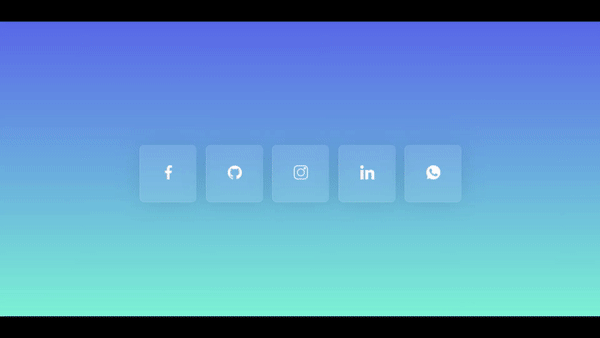

# glassmorphism-icon-hover

## Descrição:
Criação de ícones com efeito glassmorphism para tornar um layout diferenciado e aprimorar mais as técnicas em CSS.

## Técnicas:
 - [x] Flexbox;
 - [x] Glassmorphism;
 - [x] Box-Shadow;
 - [x] Hover e Transition effects;

## Projeto:

  

## Tecnologias:

## Check out the Web Page:
https://juniormacedo91.github.io/glassmorphism-icon-hover/
